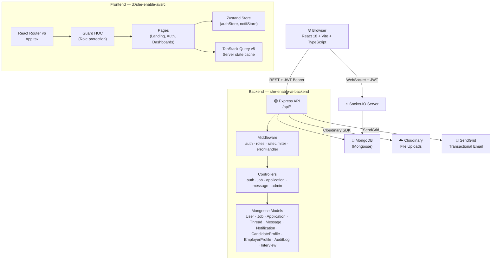
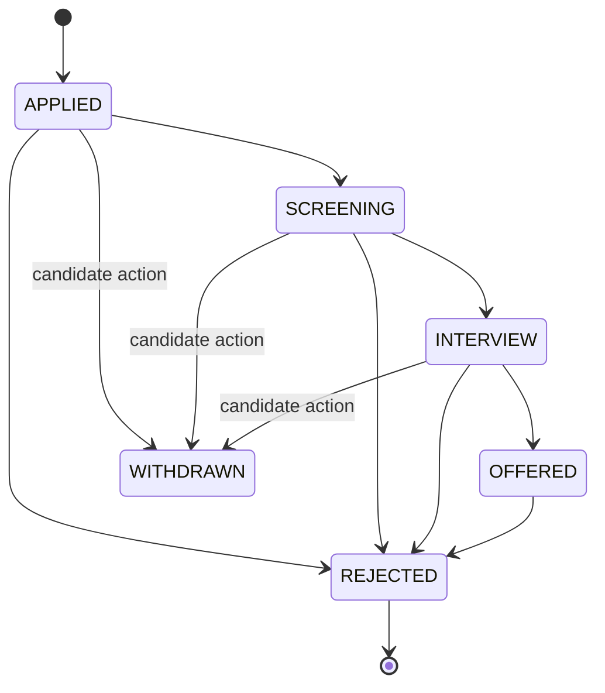

# SheEnableAI — Full-Stack Project Analysis

> **Platform**: Women hiring platform — Land → Auth → Role-based Dashboards  
> **Stack**: React 18 + TypeScript (Vite) · Node.js + Express · MongoDB (Mongoose) · Socket.IO  
> **Analyzed by**: Senior Full-Stack Developer review

---

## 📐 Architecture Overview



---

## 🗂️ Project Structure

### Frontend (`d:/she-enable-ai/src/`)

| Path | Purpose |
|------|---------|
| `App.tsx` | Root router + `Guard` HOC + `RoleHome` redirector |
| `store/authStore.ts` | Zustand persisted auth state (user, token) |
| `store/notifStore.ts` | Notification state |
| `pages/LandingPage.tsx` | Public marketing page |
| `pages/auth/` | Login · Signup · VerifyOtp (3 pages) |
| `pages/candidate/` | Dashboard · Jobs Browse · Applications · Profile · CV Builder · Messages |
| `pages/employer/` | Dashboard · Post Job · Listings · AI Search · ATS Pipeline |
| `pages/admin/` | Dashboard · Users · Security Center · Audit Log |
| `pages/superadmin/` | Dashboard · Manage Admins · Threat Monitor |
| `components/layout/` | Shared layouts/nav per role |
| `components/landing/` | Landing page sections |
| `components/ui/` | Shadcn/ui components (Radix-based) |
| `hooks/` | `use-toast` · `use-mobile` · `useReveal` |

### Backend (`she-enable-ai-backend/`)

| Path | Purpose |
|------|---------|
| `server.js` | Entry: Express + HTTP + Socket.IO bootstrap |
| `src/config/db.js` | MongoDB connection with retry logic (5 attempts) |
| `src/config/database.js` | `getDatabase()` abstraction + `isMongoConnected()` |
| `src/config/mockDB.js` | In-memory fallback when MongoDB is offline |
| `src/models/` | 10 Mongoose schemas (see below) |
| `src/controllers/` | 9 controller modules |
| `src/routes/` | 9 route files with express-validator rules |
| `src/middleware/` | auth · roles · rateLimiter · errorHandler · optionalAuth |
| `src/services/` | emailService (SendGrid) · auditService |

---

## 🗄️ Data Models

```mermaid
erDiagram
    User ||--o{ Job : "EMPLOYER posts"
    User ||--o{ Application : "CANDIDATE applies"
    User ||--o{ CandidateProfile : "1:1"
    User ||--o{ EmployerProfile : "1:1"
    Job ||--o{ Application : "receives"
    Application ||--o{ Interview : "schedules"
    User ||--o{ Thread : "participates"
    Thread ||--o{ Message : "contains"
    User ||--o{ Notification : "receives"
    User ||--o{ AuditLog : "generates"

    User {
        string firstName
        string lastName
        string email unique
        string password bcrypt-12
        enum role "CANDIDATE|EMPLOYER|ADMIN|SUPER_ADMIN"
        bool isVerified
        bool isActive
        string otpCode select-false
        string refreshToken select-false
        date lastLogin
    }
    Job {
        ObjectId employerId ref-User
        string title text-indexed
        string description text-indexed
        enum jobType "FULLTIME|PARTTIME|CONTRACT|INTERNSHIP"
        enum jobMode "REMOTE|HYBRID|ONSITE"
        enum status "DRAFT|PUBLISHED|CLOSED|ARCHIVED"
        number salaryMin
        number salaryMax
        number viewCount
        number applicationCount
        date deadline
    }
    Application {
        ObjectId jobId
        ObjectId candidateId
        enum status "APPLIED|SCREENING|INTERVIEW|OFFERED|REJECTED|WITHDRAWN"
        array statusHistory
        number aiMatchScore
        string coverLetter
        string resumeUrl
        object offerDetails
    }
    CandidateProfile {
        ObjectId userId unique
        string title
        string bio
        array skills "name + proficiency"
        array education
        array experience
        array certifications
        array savedJobs
        string cvUrl
        number profileCompletionScore
    }
```

---

## 🔐 Authentication Flow

```
Register → OTP Email (SendGrid) → VerifyOTP → JWT Access (15m) + Refresh Cookie (7d) → Login
```

- **Access token**: `JWT_SECRET`, 15-minute lifespan, sent in `Authorization: Bearer`
- **Refresh token**: `JWT_REFRESH_SECRET`, 7 days, stored in `httpOnly` cookie
- **OTP**: 6-digit, 10-minute expiry, stored in User doc with `select: false`
- **Passwords**: `bcrypt` with salt rounds 12
- **Dev fallback**: If MongoDB offline, any 6-digit OTP is accepted, devOtp returned in register response

---

## 🛣️ API Routes Summary

| Method | Endpoint | Auth | Role |
|--------|----------|------|------|
| POST | `/api/auth/register` | ❌ | — |
| POST | `/api/auth/verify-otp` | ❌ | — |
| POST | `/api/auth/login` | ❌ | — |
| POST | `/api/auth/refresh` | ❌ | — |
| POST | `/api/auth/logout` | ✅ | Any |
| GET | `/api/jobs` | Optional | Any |
| GET | `/api/jobs/:id` | Optional | Any |
| POST | `/api/jobs` | ✅ | EMPLOYER |
| PUT | `/api/jobs/:id` | ✅ | EMPLOYER (owner) |
| DELETE | `/api/jobs/:id` | ✅ | EMPLOYER/ADMIN/SUPER_ADMIN |
| POST | `/api/jobs/:id/apply` | ✅ | CANDIDATE |
| POST | `/api/jobs/:id/save` | ✅ | CANDIDATE |
| GET | `/api/applications` | ✅ | CANDIDATE/EMPLOYER |
| PATCH | `/api/applications/:id/status` | ✅ | EMPLOYER (job owner) |
| POST | `/api/applications/:id/withdraw` | ✅ | CANDIDATE |
| GET | `/api/applications/pipeline/:jobId` | ✅ | EMPLOYER |
| GET | `/api/messages/threads` | ✅ | CANDIDATE/EMPLOYER |
| POST | `/api/messages/threads` | ✅ | CANDIDATE/EMPLOYER |
| GET | `/api/messages/threads/:id/messages` | ✅ | Participant |
| GET | `/api/admin/users` | ✅ | ADMIN/SUPER_ADMIN |
| PATCH | `/api/admin/users/:id/status` | ✅ | ADMIN/SUPER_ADMIN |
| GET | `/api/admin/stats` | ✅ | ADMIN/SUPER_ADMIN |
| GET | `/api/admin/audit-logs` | ✅ | ADMIN/SUPER_ADMIN |
| POST | `/api/upload/cv` | ✅ | CANDIDATE |
| POST | `/api/upload/avatar` | ✅ | Any |

---

## ⚡ Real-time (Socket.IO)

The Socket.IO server runs on the same HTTP instance as Express with JWT auth middleware on every connection.

| Event | Direction | Purpose |
|-------|-----------|---------|
| `send-message` | Client → Server | Send a chat message, updates thread unread count |
| `new-message` | Server → Client | Broadcast message to recipient + other sender tabs |
| `typing-start` | Client → Server | Notify recipient user is typing |
| `typing-stop` | Client → Server | Notify recipient stopped typing |
| `mark-read` | Client → Server | Mark thread messages as read |
| `messages-read` | Server → Client | Notify sender that messages were read |
| `user-online` | Server → All | Broadcast when a user connects |
| `user-offline` | Server → All | Broadcast when last socket of a user disconnects |
| `unread-update` | Server → Client | Push unread count change |
| `new-application` | Server → Employer | Notify employer of new application |
| `application-update` | Server → Candidate | Notify candidate of status change |

**Online tracking**: In-memory `Map<userId, Set<socketId>>` — resets on server restart.

---

## 🏭 Application Status Machine



Transitions are enforced server-side via `ALLOWED_TRANSITIONS` object. Each transition is saved in `statusHistory[]` with timestamp, actor, and optional note.

---

## 🧩 Frontend Architecture

- **Framework**: React 18 + TypeScript + Vite (SWC for fast HMR)
- **Routing**: React Router v6 with role-based `Guard` HOC and `RoleHome` redirector
- **Server State**: TanStack Query v5 (stale time 30s, no refetch on window focus)
- **Client State**: Zustand v5 with `persist` middleware (localStorage key `hc-auth`)
- **UI System**: Shadcn/ui (Radix UI primitives + Tailwind CSS)
- **Forms**: React Hook Form + Zod validation
- **Animations**: GSAP v3 (used in landing page)
- **Charts**: Recharts (dashboards)
- **Notifications**: Sonner (toasts) + custom `use-toast` hook
- **File Upload**: Cloudinary (avatar + CV)

---

## 🚨 Issues & Gaps Found

### 🔴 Critical

| # | Issue | Location | Impact |
|---|-------|----------|--------|
| 1 | `login()` references bare `User` (not imported in that scope) | `authController.js:129` | Runtime crash on login |
| 2 | `CORS` hardcoded `return callback(null, true)` for all origins | `server.js:38` | Security bypass in production |
| 3 | **Online user map is in-memory** — server restart loses all online state | `server.js:85` | Not production-safe |
| 4 | `authStore` stores only `{ id, email, role }` but many pages need `firstName`, `avatarUrl` | `authStore.ts:7-11` | Runtime `undefined` renders throughout |

### 🟠 High Priority

| # | Issue | Location | Impact |
|---|-------|----------|--------|
| 5 | No token refresh interceptor in frontend — access token expires after 15min with no auto-refresh | Frontend (Axios layer) | Users silently logged out |
| 6 | `bulkUpdateStatus` does not verify job ownership before updating applications | `applicationController.js:108` | Any authenticated employer can bulk-update any application |
| 7 | `adminController.updateUserRole` allows setting any role including `SUPER_ADMIN` with no guard | `adminController.js:26-30` | Privilege escalation |
| 8 | No pagination on `getMyListings` — fetches all employer jobs in one query | `jobController.js:67-71` | Performance issue at scale |
| 9 | `getPipeline` uses `Promise.all` + N individual `CandidateProfile` queries | `applicationController.js:99-103` | N+1 query problem |

### 🟡 Medium Priority

| # | Issue | Location | Impact |
|---|-------|----------|--------|
| 10 | No refresh token rotation — old tokens remain valid until expiry | `authController.js` | Security risk |
| 11 | `seed.js` has no deletion guard — could re-seed production data | `seed.js` | Data integrity |
| 12 | `mockDB.js` fallback may silently pass tests/dev with fake data | `config/mockDB.js` | False confidence |
| 13 | `profileController` not reviewed — likely underimplemented | `profileController.js` | Feature gap |
| 14 | `interviewController` is only 950 bytes — very thin implementation | `interviewController.js` | Feature gap |
| 15 | AI Search page (`AISearchPage.tsx`) exists on frontend but no backend AI endpoint found | `src/pages/employer/` | Unconnected feature |

### 🟢 Strengths

- ✅ Clean MVC structure — models, controllers, routes properly separated
- ✅ `express-validator` used on all mutating routes
- ✅ Helmet + global rate limiter applied at server entry
- ✅ Soft delete pattern for jobs (`ARCHIVED` status instead of hard delete)
- ✅ Application status machine with history tracking is well-designed
- ✅ Socket.IO JWT middleware correctly validates on connection
- ✅ Cloudinary + Multer for file uploads well integrated
- ✅ SendGrid with graceful dev fallback (console.log OTP)
- ✅ MongoDB retry logic with 5-attempt backoff
- ✅ Role-based route guard both on frontend and backend
- ✅ Dual toast system (Sonner + shadcn) for notifications
- ✅ `isReadByCandidate` flag for application notification state

---

## 🗺️ Feature Completeness Matrix

| Feature | Backend | Frontend |
|---------|---------|----------|
| Auth (register/login/OTP/refresh/logout) | ✅ | ✅ |
| Job CRUD | ✅ | ✅ |
| Job search & filter | ✅ | ✅ |
| Job save/unsave | ✅ | ✅ |
| Apply to job | ✅ | ✅ |
| Application pipeline (ATS) | ✅ | ✅ |
| Bulk status update | ✅ | ⚠️ Partial |
| Real-time messaging | ✅ | ✅ |
| Typing indicators | ✅ | ✅ |
| Read receipts | ✅ | ✅ |
| File uploads (avatar + CV) | ✅ | ✅ |
| Notifications (push + email) | ✅ | ⚠️ Store only |
| Admin user management | ✅ | ✅ |
| Audit logs | ✅ | ✅ |
| Interview scheduling | ⚠️ Stub | ⚠️ Stub |
| AI candidate search | ❌ Missing | ✅ UI exists |
| CV Builder | ❌ Missing | ✅ UI exists |
| Candidate profile completion score | ⚠️ Field exists | ✅ UI exists |
| Super Admin threat monitor | ❌ Missing | ✅ UI exists |
| Token auto-refresh (interceptor) | ✅ Endpoint | ❌ Missing |

---

## 💡 Recommended Next Steps (Priority Order)

1. **Fix `login()` crash** — import `User` model at top of `authController.js`
2. **Add Axios interceptor** — auto-refresh access token on 401 responses
3. **Expand `AuthUser` store type** — include `firstName`, `lastName`, `avatarUrl`
4. **Fix `bulkUpdateStatus` authorization** — verify job ownership per application
5. **Guard `updateUserRole`** — prevent `ADMIN` from promoting to `SUPER_ADMIN`
6. **Replace N+1 in `getPipeline`** — use `populate` or a single `$lookup` aggregation
7. **Implement token rotation** — issue new refresh token on each `/refresh` call
8. **Lock production CORS** — remove the `return callback(null, true)` fallback
9. **Implement AI Search backend** — wire `AISearchPage` to a real endpoint
10. **Build out Interview scheduling** — the model is ready, controller is a stub
